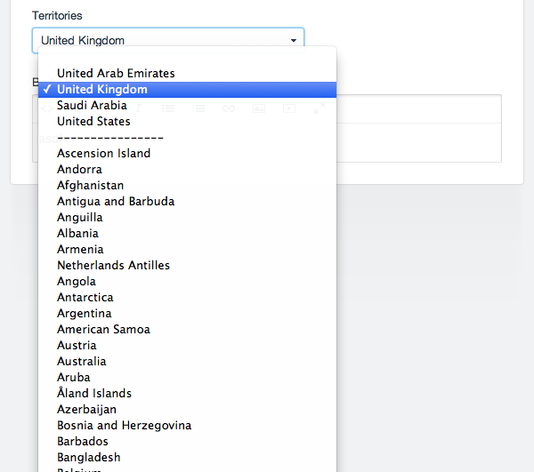
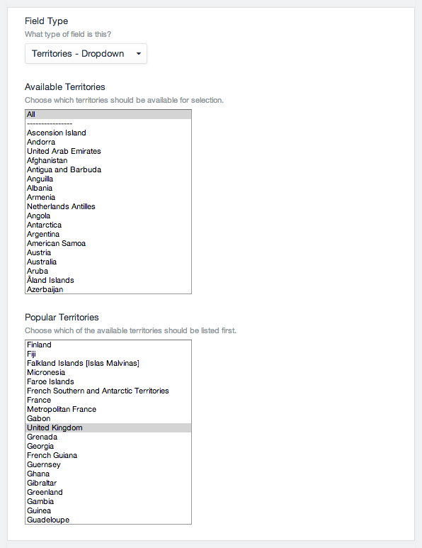

# Territories Fieldtype

A Territories Fieldtype for [Craft CMS](http://buildwithcraft.com). Give your users a dropdown ot selected territories to choose from.

## Features

* Fully translated, using Yii's own translated list of territories
* Select all or just some territories to be available in the dropdown
* Promote some territories to appear at the top of the dropdown for easy selection
* Template tags for listing our all territories available to fieldtype

## Settings

When setting up a Territories Fieldtype, there are two settings available: you can limit what Territories are available to your users, and you can "promote" some of those territories to appear at the top of the dropdown list.

## Template Tags

The two-digit abbreviations of the territory are stored in the DB, so by default this is the value returned when simply accessing the field by it's handle:

	{# Will output "us" for example #}
	{{ entry.territoryFieldHandle }}

To get the readable name of the territory, use the "label" attribute:

	{# Will output "United States" for example #}
	{{ entry.territoryFieldHandle.label }}

You can also loop through all of the available territories, as configured in the settings:

	<ul>
		
			<li class="active">{{ option }}</li>
		
	</ul>

---

## License

[http://opensource.org/licenses/mit-license.php](MIT License)
